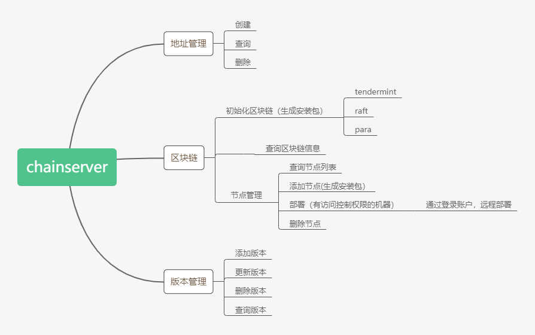

# chainserver-design

## chainserver功能需求分析




## URI接口设计

 资源|URI
 ----|-----
 地址|v1/chainserver/addrs
 区块链|v1/chainserver/blockchains
 节点|v1/chainserver/nodes
 
 
 ### 添加地址
 
 * [route] chainserver/addrs
 * [method] post
 
 * [param] 参数
 
 参数名称|参数类型|参数文档|参数默认值
 ------|------|------|-----
 uid|string|用户uid|
 name|string|地址名称|
 code|string|验证码|
 
 * [sucess] 响应  
 
  ```
  {"status":"201","code":"10000","message":"sucess","data":{"addr":"xxxx","privkey":"xxxyyy"}}
  ```
 
 * [error] 响应
 
  ```
 {"status":"403","code":"100001","message":"错误的请求内容格式","data":null}
  ```
 
 * [example] 请求示例
  ```
  http://localhost:8801/v1/chainserver/addrs?uid=1001xx&name=harrylee&code=4263
  
  ```
 
  ### 查询地址
 
 * [route] v1/chainserver/addrs
 
 * [method] get
 
 * [param] 参数
 
 参数名称|参数类型|参数文档|参数默认值
 ------|------|------|-----
 uid|string|用户uid|
 
 * [sucess] 响应
 
  ```
  {"status":"200","code":"10000","message":"sucess","data":[{"id":1,"uid":"xxxxx","mid":"yyyxx","addr":"12345xxxxaddr","pubkey":"123xxxhxxxde","privkey":"xxeeaaabcc12344",...},...]}
  ```
 
 * [error] 响应
 
  ```
  {"status":"401","code":"10001","message":"token验证错误","data":null}
  ``` 

  * [example] 请求示例
  ```
  http://localhost:8801/v1/chainserver/addrs?uid=1001xx
  ```
  
  ### 删除地址
 
 * [route] v1/chainserver/manager
 
 * [method] delete
 
 * [param] 参数
 
 参数名称|参数类型|参数文档|参数默认值
 ------|------|------|-----
 uid|string|用户uid|
 aid|string|地址id|
 
 * [sucess] 响应
 
  ```
  {"status":"205","code":"10000","message":"删除成功","data":null}
  ```
 
 * [error] 响应
 
  ```
  {"status":"401","code":"10001","msg":"token验证错误","data":null}
  ``` 

  * [example] 请求示例
  ```
  http://localhost:8801/v1/chainserver/addrs?uid=1001xx&&aid=xxxx
  ```
  
  ### 初始化区块链
 
 * [route] v1/chainserver/blockchain
 
 * [method] post
 
 * [param] 参数
 
 参数名称|参数类型|参数文档|参数默认值
 ------|------|------|-----
 uid|string|用户uid|
 mid|string|管理员id|
 order_id|string|订单id|
 consensus_type|int|0:联盟链 1:私有链  2:平行链|
 product_type|int|产品类型 0 区块链  1区块链+云服务器
 deploy_type|int|0:单机部署 1:集群部署|
 title|string|链名称|
 node_num|int|节点数量|
 init_inner_ip|string|初始化集群时,节点内部ip,用“，”号分割|
 init_outer_ip|string|初始化集群时,节点外部IP,用“，”号分割|
 super_manager_addr|varchar(128)|管理员地址|
 block_size|int|区块大小|tendermint共识独有，其他模块默认为0|
 block_time_out|int(10)|tendermint共识独有，其他模块默认为0|
 jrpc_bind_port|int|jrpc端口|默认8801
 grpc_bind_port|int|grpc端口|默认8802
 
 * [sucess] 响应
 
  ```
  {"status":"201","code":"10000","msg":"区块链创建成功","data":null}
  ```
 
 * [error] 响应
 
  ```
  {"status":"403","code":"10001","msg":"参数错误","data":null}
  ``` 
  * [example] 请求示例, （参数放在body中)
  ```
  http://localhost:8801/v1/chainserver/blockchains
  ```
  
 ### 查看链信息（组合查询）
 
 * [route] v1/chainserver/blockchain
 
 * [method] get
 
 * [param] 参数
 
 参数名称|参数类型|参数文档|参数默认值
 ------|------|------|-----
 uid|string|用户uid|
 consensus_type|int|0:联盟链 1:私有链  2:平行链|默认1
 chain_id|string|链ID|null

 
 * [sucess] 响应
 
  ```
  {"status":"200","code":"10000","msg":"sucess","data":[{主链信息或者平行链信息}]}
  ```
 
 * [error] 响应
 
  ```
  {"status":"403","code":"10001","msg":"参数错误","data":null}
  ``` 

  * [example] 请求示例
  
   ```
    http://localhost:8801/v1/chainserver/blockchains?uid=xxxx&consensus_type=0&chain_id=xxx
   ``` 
   ### 添加节点
   
 
 * [route] v1/chainserver/nodes
 
 * [method] post
 
 * [param] 参数
 
 参数名称|参数类型|参数文档|参数默认值
 ------|------|------|-----
 uid|string|用户uid|
 consensus_type|int|0:联盟链 1:私有链  2:平行链|默认1
 chain_id|string|链ID|
 order_id|string|订单ID|
 inner_ip|string|内网ip|
 outer_ip|string|外网ip|
 

 
 * [sucess] 响应
 
  ```
  {"status":"201","code":"10000","msg":"sucess","data":null}
  ```
 
 * [error] 响应
 
  ```
  {"status":"403","code":"10001","msg":"参数错误","data":null}
  ``` 
  
 * [example] 请求示例
  ```
    http://localhost:8801/v1/chainserver/nodes
  ```  
   ### 查看链的节点信息
 
 * [route] v1/chainserver/nodes
 
 * [method] get
 
 * [param] 参数
 
 参数名称|参数类型|参数文档|参数默认值
 ------|------|------|-----
 uid|string|用户uid|
 consensus_type|int|0:联盟链 1:私有链  2:平行链|默认1
 chain_id|string|链ID|

 * [sucess] 响应
 
  ```
  {"status":"200","code":"10000","msg":"sucess","data":[{节点信息}]}
  ```
 
 * [error] 响应
 
  ```
  {"status":"403","code":"10001","msg":"参数错误","data":null}
  ``` 
  
   * [example] 请求示例
   ```
  
    http://localhost:8801/v1/chainserver/nodes?uid=xxxx&consensus_type=0&chain_id=xx01
    
   ``` 
 
  ### 删除节点
 
 * [route] v1/chainserver/nodes/{node_id}
 
 * [method] delete
 
 * [param] 参数
 
 参数名称|参数类型|参数文档|参数默认值
 ------|------|------|-----
 uid|string|用户uid|
 node_id|string|节点id|

 
 * [sucess] 响应
 
  ```
  {"status":"205","code":"10000","msg":"sucess","data":null}
  ```
 
 * [error] 响应
 
  ```
  {"status":"403","code":"10001","msg":"参数错误","data":null}
  ``` 
 * [example] 请求示例
  ```
    http://localhost:8801/v1/chainserver/nodes/xxxx
    
  ```
  
  ### 部署节点
 
 * [route] v1/chainserver/nodes/{node_id}
 
 * [method] post
 
 * [param] 参数
 
 参数名称|参数类型|参数文档|参数默认值
 ------|------|------|-----
 uid|string|用户uid|
 node_id|string|节点id|

 
 * [sucess] 响应
 
  ```
  {"status":"202","code":"10000","msg":"sucess","data":[{}]}
  ```
 
 * [error] 响应
 
  ```
  {"status":"403","code":"10001","msg":"参数错误","data":null}
  ``` 
 * [example] 请求示例
  ```
    http://localhost:8801/v1/chainserver/nodes/xxxx
   
  ```
  
    ### 查看节点信息
 
 * [route] v1/chainserver/nodes/{node_id}
 
 * [method] get
 
 * [param] 参数
 
 参数名称|参数类型|参数文档|参数默认值
 ------|------|------|-----
 uid|string|用户uid|
 node_id|string|节点id|

 
 * [sucess] 响应
 
  ```
  {"status":"200","code":"10000","msg":"sucess","data":{节点信息}}
  ```
 
 * [error] 响应
 
  ```
  {"status":"403","code":"10001","msg":"参数错误","data":null}
  ``` 
 * [example] 请求示例
  ```
    http://localhost:8801/v1/chainserver/nodes/xxxx
  ``` 
  
 ## 表设计
 
**地址信息表chainserver_addr**

 字段|类型|说明
 ---|---|---
 id |interger(11)|主键ID
 uid|varchar(32)|用户UID
 aid|varchar(32)|地址ID,必须唯一
 name|varchar(64)|地址名称
 addr|varchar(128)|地址
 pubkey|varchar(256)|公钥
 privkey|varchar(256)|私钥
 status|tinyint(4)|地址状态，0正常，1删除
 create_time|bigint(20)|新建时间
 update_time|bigint(20)|更新时间


**主链配置信息表chainserver_mainchain**

字段|类型|说明
---|---|--
id |interger(11)|主键ID
uid|varchar(32)|用户UID
order_id|varchar(32)|订单编号
chain_id|varchar(32)|主链ID
consensus_type|int(1)|0:联盟链 1:私有链 
product_type|int(1)|产品类型 0 区块链  1区块链+云服务器
deploy_type|int(1)|0:单机部署 1:集群部署
title|varchar(32)|链名称
node_num|int(11)|节点数量
init_inner_ip|varchar(512)|初始化集群时,节点内部ip,用“，”号分割
init_outer_ip|varchar(512)|初始化集群时,节点外部IP,用“，”号分割
history_inner_ip|varchar(1024)|历史节点记录,只增不删
current_inner_ip|varchar(1024)|当前的节点内网ip,增删都执行
history_outer_ip|varchar(1024)|历史节点记录,只增不删
current_outer_ip|varchar(1024)|当前的节点ip,增删都执行
super_manager_aid|varchar(32)|管理员地址aid
~~super_manager_addr~~|~~varchar(128)~~|~~管理员地址~~
block_size|int(10)|区块大小
block_time_out|int(10)|出块间隔，超时时间
jrpc_bind_port|int|jrpc端口，默认8801
grpc_bind_port|int|grpc端口，默认8802
genesis_aid|varchar(32)|创世地址aid
~~genesis_addr~~|~~varchar(128)~~|~~创世地址~~
genesis_block_time|bigint(20) |创世区块时间
params|varchar(1024)|预留配置参数
chain_version|varchar(32)|链的二进制版本包
chain_url|varchar(512)|模版本下载地址
download_url|varchar(1500)|配置文件包生成地址
status|tinyint(4)|安装包生成状态，0未处理，1表示成功，2表示失败
detail|varchar(10240)|操作详细信息当部署失败时，存储具体的失败原因
create_time|bigint(20)|创建时间
update_time|bigint(20)|更新时间


**平行链配置信息表chainserver_parachain**

字段|类型|说明
---|---|--
id |interger(11)|主键 
uid|varchar(32)|用户UID
mainchain_id|varchar(32)|主链ID
chain_id|varchar(32)|链ID
order_id|varchar(32)|订单编号
product_type|int(1)|产品类型 0 区块链  1区块链+云服务器
deploy_type|int(1)|0:单机部署 1:集群部署
title|varchar(32)|链名称
node_num|int(11)|节点数量
init_inner_ip|varchar(512)|初始化集群时,节点内部ip,用“，”号分割
init_outer_ip|varchar(512)|初始化集群时,节点外部IP,用“，”号分割
history_inner_ip|varchar(1024)|历史节点记录,只增不删
current_inner_ip|varchar(1024)|当前的节点内网ip,增删都执行
history_outer_ip|varchar(1024)|历史节点记录,只增不删
current_outer_ip|varchar(1024)|当前的节点ip,增删都执行
title|varchar(128)|平行链名称
super_manager_aid|varchar(32)|管理员地址aid
~~super_manager_addr~~|~~varchar(128)~~|~~管理员地址~~
jrpc_bind_port|int|jrpc端口，默认8901
grpc_bind_port|int|grpc端口，默认8902
start_height|int|开始同步高度
coin_symbol|varchar(32)|主代币符号
genesis_aid|varchar(32)|创世地址aid
~~genesis_addr~~|~~varchar(128)~~|~~创世地址~~
genesis_block_time|bigint(20) |创世区块时间
params|varchar(1024)|预留配置参数
chain_version|varchar(32)|链的二进制版本包
chain_url|varchar(512)|模版本下载地址
download_url|varchar(1500)|配置文件包生成地址
status|tinyint(4)|安装包生成状态，0未处理，1表示成功，2表示失败
detail|varchar(10240)|操作详细信息当部署失败时，存储具体的失败原因
create_time|bigint(20)|创建时间
update_time|bigint(20)|更新时间

**节点信息表 chainserver_node**

字段|类型|说明
---|---|--
id |interger(11)|主键ID
uid|varchar(32)|用户UID
chain_id|varchar(32)|chain_id
node_id|varchar(32)|node_id
order_id|varchar(32)|订单编号
consensus_type|int(1)|0:联盟链 1:私有链 2:平行链
init_inner_ip|varchar(512)|节点内部ip
init_outer_ip|varchar(512)|节点外部IP
type|tinyint(4)|节点类型，0：共识，1：普通的
access_user|varchar(50)|登录用户
access_password|varchar(50)|登录密码
ssh_port|int|登录端口，默认22端口
status|tinyint(4)|部署状态，0未部署，1表示成功，2表示部署失败
detail|varchar(10240)|操作详细信息当部署失败时，存储具体的失败原因
create_time|bigint(20)|创建时间
update_time|bigint(20)|更新时间


**二进制包版本信息表 chainserver_version**

字段|类型|说明
---|---|--
id |interger(11)|主键ID
uid|varchar(32)|管理员用户UID
package_name|varchar(255)|包名
chain_url|varchar(255)|模版本下载地址
status|tinyint(4)|状态 0：不可用，1：可用
detail|varchar(10240)|操作详细信息
create_time|bigint(20)|创建时间
update_time|bigint(20)|更新时间
