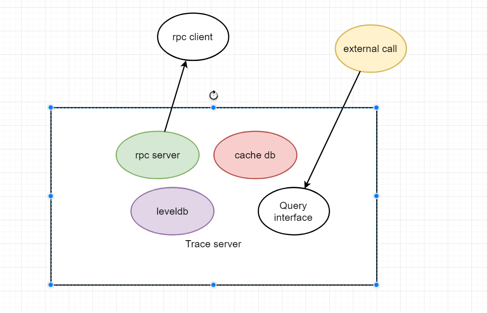

# 1.背景
 为了更好地定位和跟踪chain33系统中交易的执行情况，降低系统的运维成本，我们南京这边的团队，经过讨论之后，决定为chain33 量身打造一款日志跟踪系统，
 用于支撑一些基本的问题定位。
# 2.论证分析
我所负责的时日志传输与存储模块，经过一些列的调研测试后，我决定传输采用grpc方式进场传输，采用csv 形式进行存储日志，根据taskId 和节点名称创建
相应的db,同时为了抵御可能存在的消息风暴，增加了cachedb，缓存消息，利用leveldb去做索引，最后对生成的日志进行二次压缩，总得来讲，能够满足基本需求 
# 3.架构设计图

