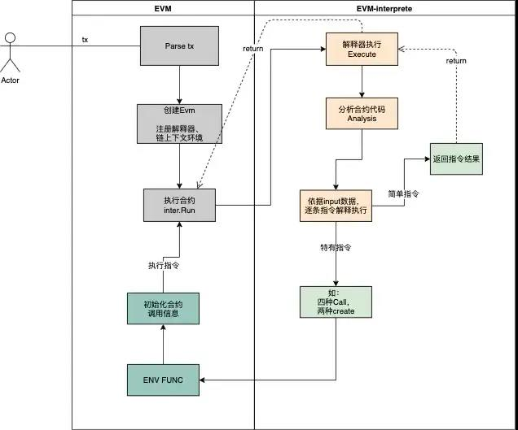

# evm虚拟机升级篇

## 背景

  最近公司CTO要求升级一下老版本的evm,由于当时负责这个模块的同事早已经离职了，因此这个任务交给了我，经过磕磕绊绊将近半个月，
  终于把chain33中一些新的指令集和相关依赖库升级完和以太坊中保持一致。下面将总结一下以太坊虚拟机的整个实现流程。
  

## evm组成

  EVM主要由三部分组成：链的上下文StateDB环境、指令解释器Interpreter、Environment Function；作为独立的三部分，各自在运行虚拟机中运行中起着不同的作用。
链的上下文StateDB环境：向EVM虚拟机提供链上数据支持，同时可以将合约执行过程中的需要存储的数据持久化至链上；例如：合约执行过程中账户余额的更新、合约账户内部状态的更新等。类似于通用计算机中的硬盘。
指令解释器Interpreter：解释执行编译后合约字节码，与一般虚拟机不同的是，EVM执行中有Gas的概念，用来解决停机和资源消耗问题，所以在解释器执行指令时，也会对计算相应指令的Gas消耗。解释器依据PC调用相应的指令，从堆栈、内存中获取该指令所需的操作数；如果属于简单指令（如：算术ADD、比较指令GT...），则解释器直接计算相应指令的结果；如果属于EVM语义的指令（如：SSTORE、CALL），则将操作数与StateDB或Enviroment Function进行交互，计算指令结果，然后将结果存入堆栈。
Environment Function(简写ENV FUNC)：提供EVM特有指令的执行逻辑，使用指令的操作数、StateDB进行交互，计算执行结果（如：对于CALL指令，EVM先从堆栈中获取指令所需的操作数，将操作数和StateDB传入ENV FUNC，ENV FUNC使用自身的执行逻辑和传入数据，计算结果，返回给解释器）

## evm执行流程

