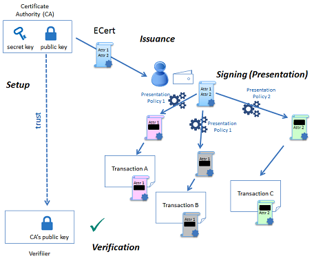
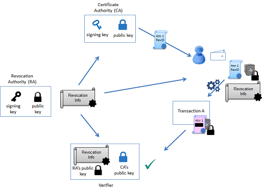

# frabic中零知识证明的应用

## 前言

Fabric 1.3中的新增的idemixer(Identity Mixer)说是采用了zero-knowledge proof(零知识证明)黑科技，零知识证明是什么东西。

## 零知识入门

这里用frabic官方给的例子。 假设Alice需要向Bob(门店职员)证明她DMV(车管所)颁发的合法驾照。这个场景,Alice就是下图的user/用户, DMV车管所则是issuer/证书颁发者, Bob则是verifier验证者。

  - 发布者以数字证书的形式发布一组用户属性，以下称此证书为“凭证（credential）”。
  
  - 用户随后会生成一个 “零知识证明” 来证明自己拥有这个凭证，并且只选择性的公开自己想公开的属性。这个证明，因为是零知识的，所以不会向验证者、发布者或任何人 透露任何额外信息。

Alice为了证明自己是合法的司机,大多时候她会把自己的驾照交给Bob检查和验证，但这样做Bob就可以知道Alice的很多额外的隐私信息,例如名字,地址,年龄等。

如果使用idemixer和零正式证明的方式, 我们只允许Bob知道当前这个女用户是个合法的司机,其它信息都保密。 即使下次Alice再来门店,Alice应该提供给Bob不同的证明,保证Bob不会知道这个证明是同一个用户。

即零知识证明可提供匿名性和无关联性。

零知识证明的益处：

- 数据隐私保护和身份验证,如上面Alice和Bob的例子所示
- 减少计算和扩容,同样的多次计算可以使用零知识证明压缩和减少,最新的以太坊可是大力推崇

## frabic中idemix

具体可以参考官方文档 https://hyperledger-fabric-cn.readthedocs.io/zh/latest/idemix.html#id2

这里不做过多的讨论，重点关注一下整个流程

https://github.com/hyperledger/fabric/-/blob/idemix/idemix_test.go

这个测试文件里面有完整的测试步骤。后面有时间的话，仔细看一下代码，补充一下详细的细节

**证明的生成**

凭证的生成过程其实是用户和发布方之间的一种交互协议

发布方将其密钥和公钥以及用户属性值作为输入，
用户将发布方公钥和用户密钥作为输入

发布协议包括以下步骤:

1. 发布方随机发送一个nonce给用户

2. 用户使用发布方的公钥、用户密钥和nonce作为输入创建凭据请求
  
  用户向发布方发送生成一个凭证请求
  
3. 发布方通过验证零知识证明来验证用户的凭证请求
 如果请求是有效的，则签署对密钥的承诺向用户颁发凭据，连同属性值一起返回给用户  
 
4. 用户验证发布方的签名并存储由签名值、用于创建签名的随机性、用户秘密和属性值组成的凭证

**身份混淆**

1. 用户先根据自己的私钥和发布方的公钥还是有之前生成的RNG随机因子，生成一个假名nym

2. 然后用户根据自己的私钥和生成的这个nym假名，还有发部方的公钥，对数据进行签名。

3. 用户把自己之前生成的nym假名公布出去，别人可以用这个nym来验签

**流程**

根据上面介绍，我们可以知道 fabric中idemix工作流程主要如下图所示

- 安装 
 
   生成证书颁发机构（CA）签名密钥对，并使公钥可供区块链参与者使用。

- 发布 

   对等方或客户端会生成一个秘密密钥，并创建对注册证书（ECert）的请求。（CA）以身份混合器凭证的形式颁发ECert。注册证书还包含链成员（或对等成员）具有的属性。ECert与相应的凭证密钥一起存储在对等端或由客户端SDK存储。

- 匿名交易签名。
  当客户或对等方需要签署交易时，它会生成一个新的不可链接的呈现令牌，该令牌：
  
   1）签署交易内容
   
   2）证明拥有由CA颁发的有效ECert
   
   3）公开以下属性：事务的访问控制策略要求
      
- 验签 
   使用CA的公钥验证令牌。

**与X509CA的对比**

- 共同点：

   都需要一个权威的机构去信用背书
   
- 区别：

   X509中所有属性对外可见
   
   idemix中可以通过policy策略配置和身份混淆的方式，采用不同的假名对外只暴露一部分属性，但是外部人员没法通过假名进行拼接，推测出所有属性。
   
  除了能够在表示期间隐藏所有或仅选择的属性外，身份混合算法还允许只证明关于属性的谓词，而不显示它们的值。例如，一个人可以通过证明出生日期属性在过去21年以上来证明他/她的年龄大于21岁，而不需要从他/她的证书中显示出确切的出生日期

**凭证可撤回**

可以通过在黑名单(所谓的证书撤销列表，或CRL)中添加一个唯一的证书ID来撤销X.509证书，并在验证期间检查该证书是否不在当前CRL上。
由于通过标准CRL为撤销检查显示唯一的标识符会破坏不可链接性，身份混合器实现了保护隐私的撤销机制，该机制允许验证者以零知识的方式检查凭证是否被撤销(凭证没有列入黑名单)，即，而不会破坏未撤销用户的不可链接性。

 权威机构通过CreateCRL (Credential Revocation Information)，创建一个CRL,里面包含了epoch，epochPK,epochPKSig,RevocationData,用户通过RA的公钥来对CRL进行验证。验证数据在这个epoch内是否有效。

## 安全讨论

[参考资料](https://hyperledger-fabric-cn.readthedocs.io/zh/latest/idemix.html)

