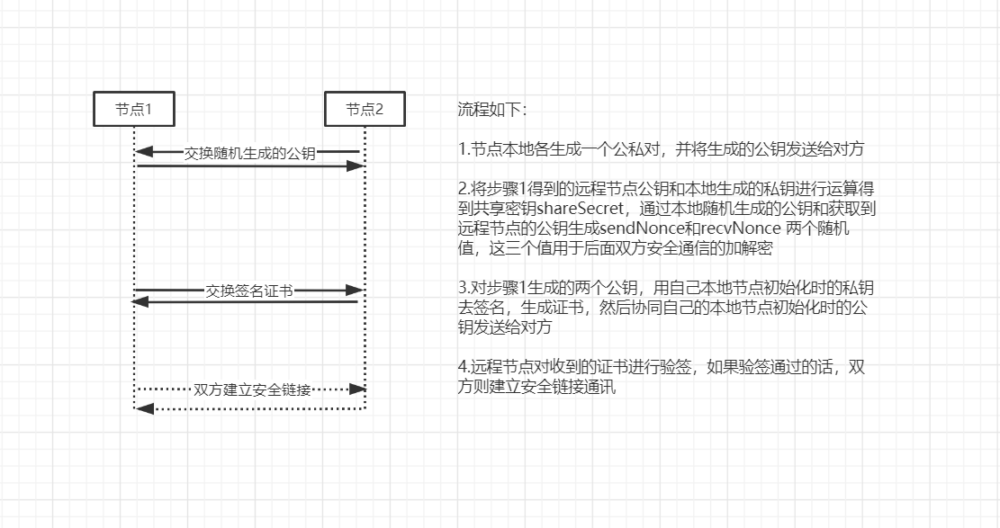

# tendermint共识中的网络模型分析

## tendermint网络
tendermint中共识模块网络复用了p2p网络，tendermint中的p2p网络严格上来讲，其实不算p2p，因为它本身不具备节点发现的功能，只是简单的拨号连接，只是在每次建立链接时，
会用本地节点的公私钥做一次鉴权，通过对双方随机生成的公钥信息生成的challenge进行签名，验签通过的话，双方建立安全链接通讯，通讯密钥则由本地随机生成的密钥对的私钥和远程节点传输过来的随机生成的公钥混合生成的一个sharesecret，通讯内容则是对消息体的封装，通过不同的goroutine进行处理。

**流程如下：**

1.节点本地各生成一个公私对，并将生成的公钥发送给对方

2.将步骤1得到的远程节点公钥和本地生成的私钥进行运算得到共享密钥shareSecret，通过本地随机生成的公钥和获取到远程节点的公钥生成sendNonce和recvNonce 两个随机值，这三个值用于后面双方安全通信的加解密

3.对步骤1生成的两个公钥，用自己本地节点初始化时的私钥去签名，生成证书，然后协同自己的本地节点初始化时的公钥发送给对方

4.远程节点对收到的证书进行验签，如果验签通过的话，双方则建立安全链接通讯

理论上讲，如果节点不本地校验远程节点的public-key是否合法的话，会存在其他伪造节点发送一个错误的信息的安全风险。节点广播消息的话，会遍历自己本地缓存的其他节点信息，（一般时validator节点,集群初始化时，从配置文件中读取）然后依次发送。

## libp2p网络

libp2p网络与tendermint网络不同，libp2p是真正意义上的p2p网络，可以做到节点的自动发现，并且新节点接入相应的网络没有限制

## tendermint共识中复用libp2p网络方案及需要处理的问题点

**方案一**

只针对tendermint共识模板插件进行改造，改造其内部网络通信，增加局域网中得服务发现功能。

- 优点
    
    - 只涉及本模块得改造，不影响其模板，相对工作量要小

- 缺点

    - 还是需要沿用tendermint内置的网络，还是需要在配置文件添加节点信息，比如验证节点私钥，公钥地址，权重值之类的信息
    
  

**方案二**

 修改chain33项目dht p2p原生插件，新增一些广播消息的接口，同时新增p2p模板与consense模型之间的消息订阅事件，移除tendermint原有网络中的封装的传输协议，改造成适配libp2p的协议

- 优点
    
    - 减少chain33.toml文件中的配置项，理论上共识网络不需要全部联通，可以通过中继节点进行广播通信

- 缺点

    - 需要修改多个模块，模板与模板之间存在依赖关系，改造后的tendermint只能使用dht p2p网络，与此同时，因为网络原因，可能存在诸多不确定的因素导致共识模有问题，比如共识慢（因为需要通过广播方式发送共识消息），需要做消息重复广播过滤等等，节点入网规则需要自己定义，同时节点需要定时发送心跳包，之类的信息，可能会对p2p网络产生拥堵。

**方案三**

 在方案一和方案二的基础之上，复用tendermint插件中网络接口定义，对其进行改造，在其之上包装一层p2p网络通信

- 优点
    
    - 减少chain33.toml文件中的配置项，复用原有的gensis.json,priv_validator.json等配置文件，理论上共识节点网络也不需要全部联通，可以通过中继节点进行广播通信

- 缺点

    - 需要修改多个模块，模板与模板之间存在依赖关系，改造后的tendermint只能使用dht p2p网络，与此同时，因为网络原因，可能存在诸多不确定的因素导致共识模有问题，比如共识慢（因为需要通过广播方式发送共识消息），需要做消息重复广播过滤等等

