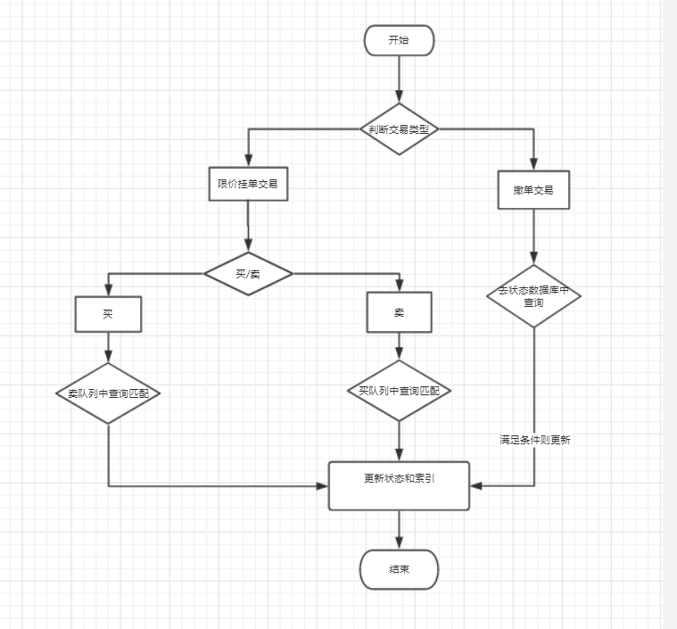

# 基于chain33开发的去中心化交易所合约

## 背景

  目前chain33官方plugin下面已经有类似的去中心化交易合约trade,但是在实际使用的过程中存在诸多问题。
  
  序号|问题
  ---|---
  1|根据挂单号买卖，不能自动撮合交易
  2| rpc查询接口,不全，不能仅根据交易对信息，获取挂单列表，需要额外的数据库去支持，繁琐
  3|构建的交易参数众多，不太好用
  
  
## 需求分析
  
  需要新构建一个新的合约，解决如上问题，实现类似如传统中心化交易所那样的便捷性
  
  序号|难点
  ---|---
  1|交易数据模型制定
  2|账户状态切换
  3|多方位的查询接口，交易对，深度，单号查询
  4|设计先进先出的队列

## 查询接口

 1.提供指定交易对的市场深度查询
 
 2.提供指定交易对挂单查询(系统内部使用）
 
 3.提供根据挂单状态查询用户自己最新的挂单信息

 4.查询最新已经成交的挂单信息
 
 
 ## 问题
 
  1.撮合过程中存在许多匹配的挂单也共用当前系统中生成的index,因此localdb存储的索引key要重新设计

## 存储模型设计

 https://github.com/harrylee2015/plugin/blob/exchange/plugin/dapp/exchange/proto/exchange.proto

## localdb索引设计

 https://github.com/harrylee2015/plugin/blob/exchange/plugin/dapp/exchange/executor/kv.go

## 查询接口设计

 https://github.com/harrylee2015/plugin/blob/exchange/plugin/dapp/exchange/executor/query.go

## exchange合约执行流程

